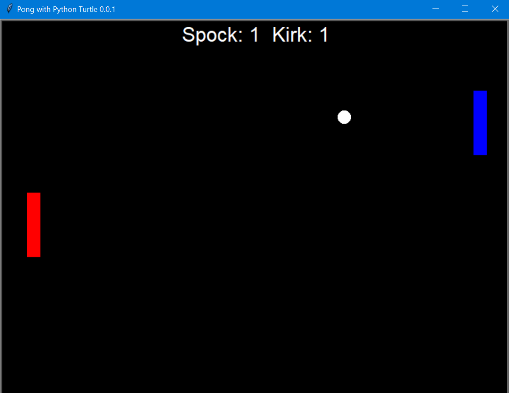
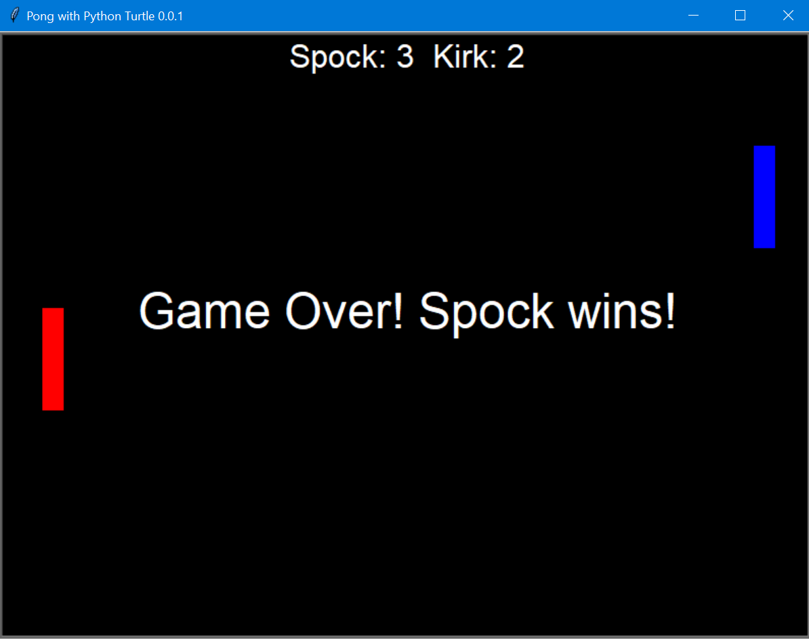

# Pong with Python Turtle

The classic pong game coded in Python. Player vs. Player mode.
**Player1 (red)** controls: `w`, `s` for up, down movements
**Player2 (blue)** controls: `UpArrow`, `DownArrow` for up, down movements

## Status

Finished

## Features

- Fully customizable screen
- Custom player names, player colors
- Adjustable ball speed

## How to use

- Clone the repository locally or Download it as .zip file.
- Install Python and the turtle module. Write in the terminal
  `pip install turtle` or `pip install turtle==0.0.1`
- In terminal, run `game.py`. Write `python game.py` in terminal.
- You will be asked to enter Player1, Player 2 names and then you can play.
  Have fun!

## Customization

- If you want to adjust ball speed and win point, then in the last line of `game.py`, change the `ballSpeed` and `maxPoints` accordingly.
- You can also change the screen `width`, `height` and background color in the same line.
- There is an option to enter ball speed during the game, set `ballSpeedSet` to `False` and pass any value to `ballSpeed`.
- If you don't want to enter player names, every time you play, change `playerSet` to `True` and change `player1` and `player2` dictionaries accordingly.

```
if __name__ == '__main__':
    player1 = {
        "name": "Player 1",  # change this
        # color name or rgb(r, g, b) values eg. rgb(255, 255, 255) or white
        "color": "red"
    }
    player2 = {
        "name": "Player 2",  # change this
        # color name or rgb(r, g, b) values eg. rgb(255, 255, 255) or white
        "color": "blue"
    }
    play(player1, player2, playerSet=False, ballSpeedSet=True, ballSpeed=5, maxPoints=3,
         width=800, height=600, bgcolor="black")

```

## Screengrab



<p style="text-align: center; font-weight: bold;">Game in progress</p>



<p style="text-align: center; font-weight: bold;">Game over</p>

## Credits

- [How to Code Pong in Python – a Step-By-Step Tutorial with Turtle](https://www.freecodecamp.org/news/how-to-code-pong-in-python/)
- [Create pong game using Python – Turtle](https://www.geeksforgeeks.org/create-pong-game-using-python-turtle/)
